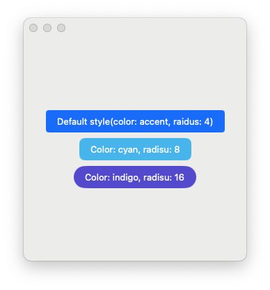
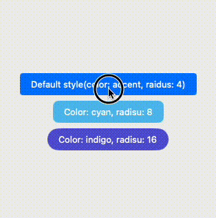

# SwiftUIMaterialButton
A material design style button for swiftUI with ripple effect.

## Installation
Open XCode, **File** -> **Add Package Denpendencies** -> Search `https://github.com/boybeak/SwiftUIMaterialButton.git` -> **Add Package**.

## Usage
```swift
import SwiftUIMaterialButton

struct MaterialButtonView : View {
    var body: some View {
        VStack {
            MaterialButton(
                action: {
                }, 
                label: {
                    Text("Default style(color: accent, raidus: 4)")
                }
            )
            
            MaterialButton(
                backgroundColor: .cyan,
                radius: 8,
                action: {
                },
                label: {
                    Text("Color: cyan, radisu: 8")
                }
            )
            
            MaterialButton(
                backgroundColor: .indigo,
                radius: 16,
                action: {
                },
                label: {
                    Text("Color: indigo, radisu: 16")
                }
            )
        }
    }
}
```


